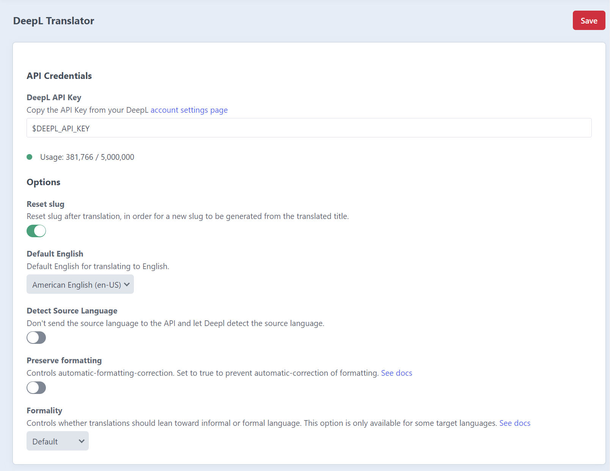
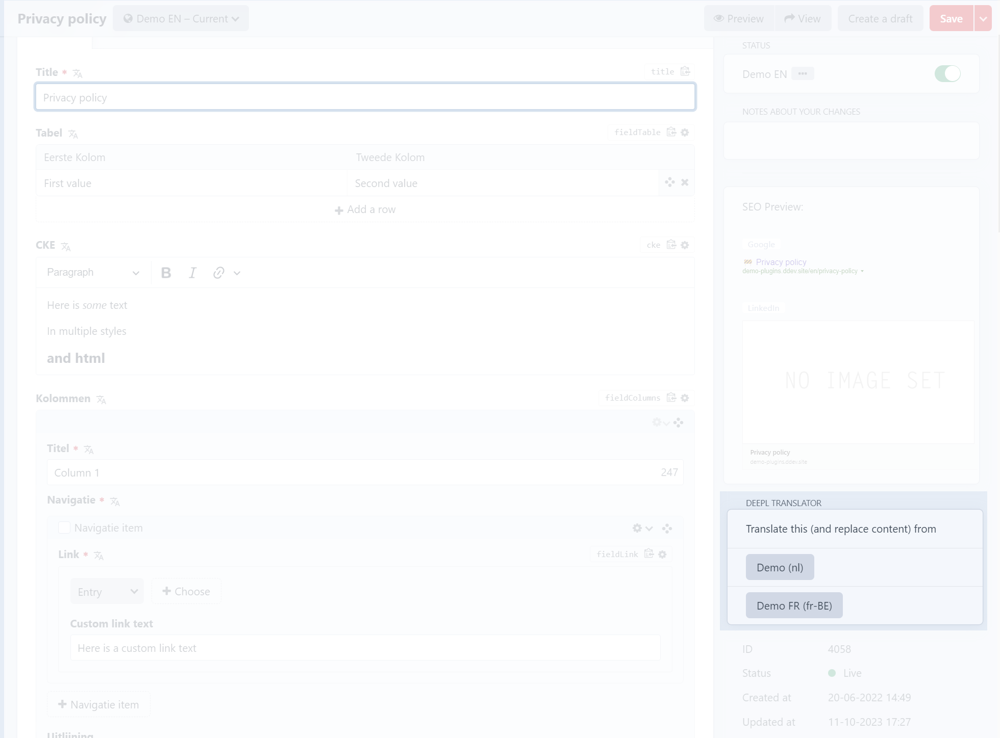
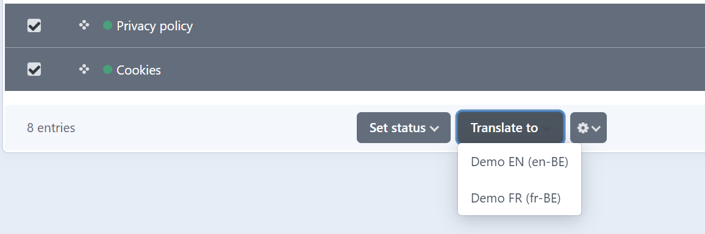

# Multi Translator

Translate content of elements using external services

## Requirements

This plugin requires Craft CMS 4.4.0 or later, and PHP 8.0.2 or later.

You need an account at [Deepl](https://www.deepl.com/nl/pro-api) to get an API Key

## Installation

You can install this plugin from the Plugin Store or with Composer.

#### From the Plugin Store

Go to the Plugin Store in your project’s Control Panel and search for “Multi Translator”. Then press “Install”.

#### With Composer

Open your terminal and run the following commands:

```bash
# go to the project directory
cd /path/to/my-project.test

# tell Composer to load the plugin
composer require digitalpulsebe/craft-multi-translator

# tell Craft to install the plugin
./craft plugin/install multi-translator
```

## Plugin Settings

Configure options in the Craft control panel settings



## Permissions

For non-admin users, enable the permission 'Translate Content' under 'Multi Translator'

## Supported field types

- craft\fields\PlainText
- craft\fields\Table
- craft\redactor\Field
- craft\ckeditor\Field
- craft\fields\Matrix (recursive)
- benf\neo\Field (recursive)
- verbb\supertable\fields\SuperTableField (recursive)
- lenz\linkfield\fields\LinkField

## Usage

There are two ways to trigger a translation.

### Translate one-by-one

1. Navigate to the entry and the desired target site/language.
2. Use the buttons in the sidebar and select the source language.



### Translate in bulk

1. Navigate to overview of entries you want to get translated.
2. Select the entries in the source language.
3. Use the 'Translate to' dropdown in the actions bar and choose the target language
4. A queue job will be started


